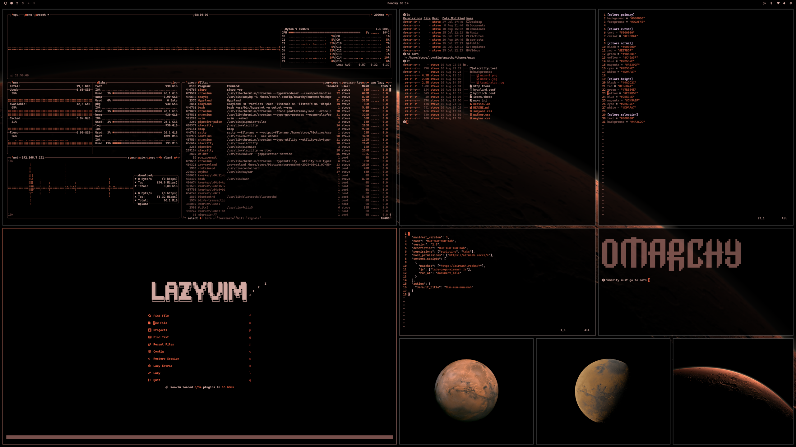

# Omarchy Mars Theme

This is the Mars Theme for [Omarchy.org](https://omarchy.org).

<p align="center">
  
</p>

## Installation

To install this theme, simply use the `omarchy-theme-install` command:

```bash
omarchy-theme-install https://github.com/steve-lohmeyer/omarchy-mars-theme
```

## Included Configurations

This theme includes configurations for:

- Alacritty (alacritty.toml)
- btop (btop.theme)
- Hyprland (hyprland.conf, hyprlock.conf)
- Mako (mako.ini)
- Neovim (neovim.lua)
- Waybar (waybar.css)
- Walker (walker.css)
- SwayOSD (swayosd.css)
- Several Desktop Backgrounds **some images courtesy of SpaceX

## Neovim theme
[https://github.com/steve-lohmeyer/mars.nvim](https://github.com/steve-lohmeyer/mars.nvim)
